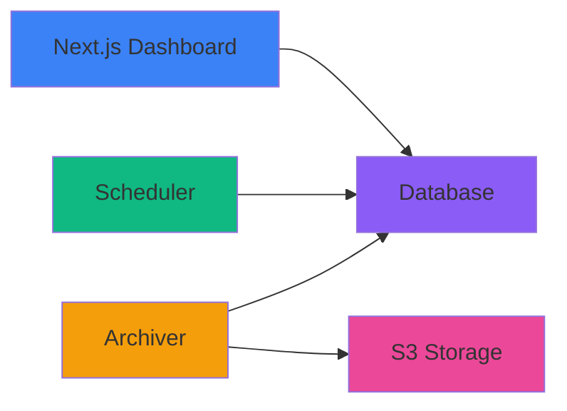

**Pongo is a self-hosted uptime monitoring platform where you define monitors, dashboards, alerts, incidents, and announcements as TypeScript files and Markdown** — version-controlled alongside your code. No UI forms. Just code.

## What is Pongo?

Pongo gives you complete control over your uptime monitoring infrastructure. Instead of clicking through web forms to configure monitors and alerts, you write TypeScript code and commit it to your repository. This approach brings all the benefits of Infrastructure as Code to your monitoring setup.

When you deploy Pongo, you get:

- A modern dashboard UI to visualize your monitor health
- Public status pages with RSS/Atom feeds
- Smart alerting with webhook notifications
- Historical data with charts and SLA tracking
- Complete customization through code

## Key Features

<CardGroup cols={2}>
  <Card title="Code-First Configuration" icon="code">
    Define everything as TypeScript files — monitors, dashboards, alerts, incidents, and announcements. Version-controlled and reviewable.
  </Card>
  
  <Card title="Flexible Monitoring" icon="chart-line">
    HTTP health checks, API status pages, custom logic, latency thresholds, cron schedules, and configurable intervals from 30 seconds to hours.
  </Card>
  
  <Card title="Smart Alerting" icon="bell">
    Declarative or callback-based conditions, flap detection, auto-resolve, region-aware thresholds, and webhook notifications.
  </Card>
  
  <Card title="Public Status Pages" icon="globe">
    Share dashboards publicly with response time charts, uptime bars, incident timelines, announcements, and RSS/Atom feeds.
  </Card>
  
  <Card title="Multi-Region Support" icon="earth-americas">
    Run schedulers in different regions and set alert thresholds based on regional health (any, all, majority).
  </Card>
  
  <Card title="Data Archival" icon="database">
    Archive old check results to S3 as Parquet files with day-based partitioning for long-term analysis.
  </Card>
</CardGroup>

## Core Capabilities

**Uptime Monitoring**
- Configurable intervals (30s, 1m, 5m, 1h) and cron schedules
- HTTP health checks with timeout control
- Custom handler logic for complex monitoring scenarios
- Response time tracking and latency percentiles (P50, P95, P99)

**Alerting**
- Declarative conditions (consecutive failures, latency thresholds, downtime duration)
- Callback-based conditions with full check history access
- Webhook notifications with retry logic and exponential backoff
- Alert silencing and escalation after configurable time periods
- Flap detection to prevent alert fatigue

**Dashboards & Status Pages**
- Response time, uptime, and error rate charts
- SLA tracking and status distribution
- Incident timelines with severity and resolution tracking
- Announcements for maintenance windows and updates
- RSS and Atom feeds for status updates

**Data Management**
- SQLite for zero-config local development
- PostgreSQL for production deployments
- S3 archival to Parquet with automatic cleanup
- Configurable retention policies

## Tech Stack

Pongo is built with modern, production-ready technologies:

<AccordionGroup>
  <Accordion title="Frontend">
    - **Next.js 16** - React framework with App Router
    - **React 19** - UI library
    - **Tailwind CSS** - Utility-first styling
    - **Radix UI** - Accessible component primitives
    - **Recharts** - Data visualization
    - **iron-session** - Encrypted cookie-based sessions
  </Accordion>
  
  <Accordion title="Backend">
    - **Bun** - Fast JavaScript runtime
    - **Hono** - Lightweight HTTP framework for scheduler API
    - **Drizzle ORM** - Type-safe SQL query builder
    - **Croner** - Cron job scheduler
    - **Zod** - Schema validation
  </Accordion>
  
  <Accordion title="Database & Storage">
    - **SQLite** - Embedded database (WAL mode)
    - **PostgreSQL** - Production database
    - **AWS S3** - Archive storage
    - **Parquet** - Columnar storage format
  </Accordion>
  
  <Accordion title="Utilities">
    - **Marked** - Markdown parser
    - **gray-matter** - Frontmatter parser
    - **date-fns** - Date utilities
    - **Biome** - Fast linter and formatter
  </Accordion>
</AccordionGroup>

## Use Cases

Pongo is designed for teams and individuals who want:

**Infrastructure as Code**
- Treat monitoring configuration as code
- Version control all changes
- Review monitoring changes through pull requests
- Replicate environments easily

**Self-Hosted Control**
- Keep sensitive monitoring data on your infrastructure
- Avoid vendor lock-in
- Customize every aspect of the platform
- Deploy anywhere (Vercel, Fly.io, Docker, VPS)

**Developer-First Workflow**
- Write TypeScript instead of clicking forms
- Use familiar tools (Git, IDE, CI/CD)
- Integrate monitoring with application code
- Test and validate monitoring configuration

**Public Status Pages**
- Share uptime data with customers
- Automatic RSS/Atom feeds
- Incident communication
- Maintenance announcements

## Architecture

Pongo consists of three main components:

**Dashboard (Next.js)**
- Web UI for viewing monitors, alerts, and dashboards
- Public status pages
- Authentication and session management
- API endpoints for status JSON and feeds

**Scheduler (Bun + Hono)**
- Runs monitors on schedule
- Evaluates alert conditions
- Dispatches webhook notifications
- HTTP API for manual triggers and health checks
- Can run multiple instances in different regions

**Archiver (Bun)**
- Archives old check results to S3 or local storage
- Converts data to Parquet format
- Day-based partitioning for efficient queries
- Configurable retention and batch size

All components share a single database (SQLite or PostgreSQL). No message queues or service mesh required.

## How It Works

1. **Define monitors** in `pongo/monitors/*.ts` using the `monitor()` function
2. **Create dashboards** in `pongo/dashboards/*.ts` to group monitors
3. **Configure channels** in `pongo/channels.ts` for webhook notifications
4. **Write incidents** as Markdown files in `pongo/incidents/`
5. **Post announcements** as Markdown files in `pongo/announcements/`
6. **Run the scheduler** to execute monitors and send alerts
7. **View the dashboard** to see real-time status and historical data
8. **Share status pages** publicly by setting `public: true` on dashboards

<Note>
  All configuration is loaded from the filesystem at runtime. Changes to monitors, dashboards, or alerts take effect immediately after deployment.
</Note>

## Next Steps

<CardGroup cols={2}>
  <Card title="Quickstart" icon="rocket" href="/quickstart">
    Get Pongo running locally in 5 minutes
  </Card>
  
  <Card title="Project Structure" icon="folder-tree" href="/project-structure">
    Learn how to organize your monitoring configuration
  </Card>
  
  <Card title="Monitors" icon="chart-line" href="/monitors">
    Create your first uptime monitor
  </Card>
  
  <Card title="Deployment" icon="rocket" href="/deployment">
    Deploy to Vercel, Fly.io, or Docker
  </Card>
</CardGroup>
